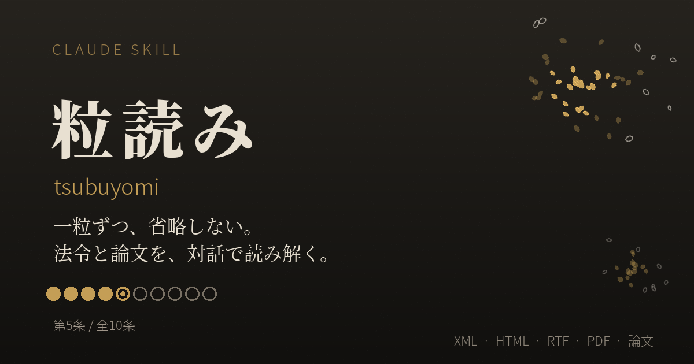

# 粒読み(つぶよみ) — 一粒ずつ、対話で読み解く



> 一粒ずつ、省略しない。法令と論文を、対話で読み解く。

法令や論文を、要約で済ませず、原文を1文字も飛ばさずに、あなたのペースで対話しながら読み解くClaude用スキルです。

## これは何?

「粒読み(tsubuyomi)」は、[Claude](https://claude.ai)の[Agent Skills](https://www.anthropic.com/news/skills)フォーマットに準拠したスキルです。法令なら1条ずつ、論文なら1段落ずつ、次のような流れで読み進めます。

1. 見出しと、全体の中での位置づけを一言で示す
2. 項・号(段落)ごとに「原文(省略なし)→平易な言い換え→用語解説」を繰り返す
3. 「次へ」と言われるまで進まず、質問や脱線に付き合う

進み具合は「粒マップ」として毎回可視化し、わからなかった点は「つまずきメモ」にためて、節目で振り返れるようにします。

```
●●◉○○○○○○○  第3条 / 全10条
```

## 対応形式

- e-Gov法令検索でダウンロードできる4形式:**XML・HTML・RTF・PDF横一段**
- 論文などの**PDF**
- **URL**・**貼り付けテキスト**

複数形式が揃っている場合はXMLを正とし、他形式は表やルビの確認に使います。RTFのルビ欠落やPDFの表崩れなど、形式ごとの落とし穴と対処は [`references/formats.md`](./references/formats.md) にまとめています。

## 使い方

1. このリポジトリ、または後述のインストール手順でスキルをClaudeに読み込ませる
2. 法令や論文のファイル・URL・テキストを渡す
3. 「粒読みを使って」「つぶよみを使って」「tsubuyomiを使って」のいずれかで明示的に呼び出す

**このスキルは明示的に呼び出したときだけ動作します。** 法令や論文が話題に出ただけでは自動発動しません。

## インストール

### Claude.ai(Web版・デスクトップアプリ)

Pro・Max・Team・Enterpriseプランで利用できます(コード実行の有効化が必要)。

1. このリポジトリを`.skill`(または`.zip`)にまとめてダウンロードする(すでにパッケージ済みの`.skill`ファイルをお使いください)
2. Claude.aiの **設定 → Capabilities(機能)** を開き、「コード実行とファイル作成」がオンになっていることを確認する
3. Skillsの項目までスクロールし、「Upload skill(スキルをアップロード)」から、ダウンロードしたファイルを選ぶ
4. 一覧に「tsubuyomi」が表示されたら、トグルをオンにする

アップロードしたスキルは自分のアカウントにのみ表示されます(組織内で共有したい場合は、Team・Enterpriseプランの管理者による組織単位での配布が必要です)。

### Claude Code

`SKILL.md` と `references/` フォルダを、スキルディレクトリにそのまま配置してください。

```bash
# プロジェクト単位
cp -r tsubuyomi .claude/skills/

# 全体(グローバル)
cp -r tsubuyomi ~/.claude/skills/
```

### Claude API

`/v1/skills` エンドポイントへアップロードして利用します。コード実行ツールとベータヘッダーの指定が必要です。詳しくは [Agent Skills のドキュメント](https://docs.claude.com/en/docs/agents-and-tools/agent-skills/overview) を参照してください。

いずれの環境も、アップロードしたスキルは環境ごとに個別管理となり、自動では同期しません。

## こんな場面に

- 業法や個人情報保護法など、実務で読み込む必要がある法令を、根拠条文まで含めて理解したいとき
- 専門分野の論文を、主張・根拠・方法を段落ごとに確かめながら読みたいとき
- 「要約だけでは不安。原文をちゃんと確認しながら進みたい」とき

## ライセンス

[MIT License](./LICENSE)

## 免責事項

- 本スキルは、法令・論文を対話しながら理解する助けとなることを目的としています。**法的助言・実務上の判断の代わりにはなりません。** 実際の法解釈や実務対応が必要な場合は、弁護士など有資格の専門家にご確認ください。
- 出力される言い換え・要約・用語解説には、誤り・不正確な内容が含まれる可能性があります。原文の内容と必ず照合してください。
- 本スキルは Anthropic の Claude 向けに、現状有姿(AS IS)で無償提供しています。動作・出力の正確性・特定目的への適合性についていかなる保証も行いません。
- 本スキルの利用、または利用によって生じたいかなる直接的・間接的・付随的な損害についても、作者は一切の責任を負いません([MIT License](./LICENSE)の条項に基づきます)。
- 不具合や改善提案は、GitHubの[Issue](../../issues)からお願いします。個別の問い合わせサポートはお約束できません。
